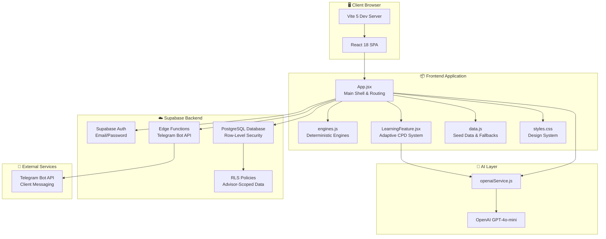

# SignalNex

> From scattered client signals to governed advisor action.

**SignalNex** is an AI-powered advisory command centre built for the **AAG x ASG ImagineHack 2026 — Track 1** challenge. It transforms fragmented client data into prioritised daily actions, intelligent partner referrals, and compliance-governed workflows — helping insurance and financial advisors know **who to contact first, what to say next, which partner to involve, and what guardrail to check before action.**

---

## Team

**Team Name:** UniCampur

| # | Name |
|---|------|
| 1 | Heng Yong An Damian |
| 2 | Chin Lok Bin |
| 3 | Chan Hao Hean |
| 4 | Hoh Wen Hao |

---

## Technologies Used

| Layer | Technology |
|-------|-----------|
| Frontend | React 18, Vite 5 |
| Backend / Database | Supabase (PostgreSQL, Auth, Edge Functions, Row-Level Security) |
| AI / LLM | OpenAI GPT-4o-mini (Smart Learning Path, Knowledge Gap Detection, Client Suggestions) |
| Messaging Integration | Telegram Bot API (via Supabase Edge Functions) |
| Language | JavaScript (ES Modules) |
| Styling | Vanilla CSS (custom design system) |

---

## Challenge and Approach

### The Problem

Advisors manage dozens of daily signals — policy reviews, missed premiums, client life events, business changes, partner opportunities, CPD needs, and compliance requirements. This information is typically scattered across CRM notes, calendars, messages, spreadsheets, and personal memory.

The result:
- Slower client follow-up and missed high-value opportunities
- Inconsistent partner referrals across AAG / ASG business units
- Late compliance and consent checks
- Higher dependence on advisor memory over structured intelligence


### Features Delivered

We successfully delivered the following fully functional features in our prototype to solve this problem:

**Productivity Features:**
- **Daily Advisor Morning Brief**: Summarises top priority clients, overnight signals, overdue tasks, and upcoming meetings.
- **Client Priority Queue**: Automatically ranks the client book based on urgency, premium value, propensity, and open tasks.
- **Client Memory & AI Behavioural Profile**: AI-generated summary of the client's interests, life events, and optimal communication channels.
- **Telegram Bot Integration**: Governed action composer to generate and send compliant client messages directly from the dashboard.

**Growth Features:**
- **Automated Partner Matching**: Connects client needs to AAG/ASG partners (e.g., SME Risk Solutions, Tax Advisory) with match scores.
- **Referral Pipeline Tracker**: Visualises open referrals with expected revenue value and stage progression (Identify → Engage → Closed).

**Learning Features:**
- **Smart Learning Path**: OpenAI-powered recommendation engine that suggests CPD modules based on the advisor's portfolio density.
- **Real-Time Knowledge Gap Detection**: Scans advisor notes to detect compliance or knowledge gaps and automatically assigns rapid micro-learning modules.
- **Knowledge Gate Quizzes**: Scenario-based quizzes contextualised to the advisor's real client book to test applied knowledge.

**Governance Features:**
- **PDPA Consent Masking**: Automatically detects expired consent, masks private client details, and completely blocks follow-ups or referrals until renewed.
- **Compliance Risk Scoring**: Flags accounts with missed premiums or high service risk before recommendations are made.
- **Dual-Role Admin Dashboard**: A separate workspace for Admins to review compliance queues, flag expenses, and monitor a real-time audit trail of all advisor actions.

### Our Approach

SignalNex addresses these gaps through **four integrated layers**:

1. **Productivity Layer** — AI-ranked client priority queue, morning brief, next-best-action engine, and Telegram-powered action composer so advisors know exactly who to contact and what to say.

2. **Growth Layer** — Automated partner desk matching (ASG Tax Advisory, AAG Estate Concierge, SME Risk Solutions, etc.), referral pipeline tracking with stage progression, and revenue impact visibility.

3. **Learning Layer** — Adaptive CPD system with portfolio-density analysis, real-time knowledge gap detection from advisor notes, AI-recommended learning paths, and Knowledge Gate quizzes contextualised to the advisor's actual client book.

4. **Governance Layer** — PDPA consent masking that blocks all private workflows until consent is verified, compliance risk scoring, admin review queues, expense flagging, and a full audit trail visible to both advisor and admin roles.

### Key Differentiators

- **Signal-to-Action Pipeline**: We don't just show data — we rank, recommend, draft, and govern the action.
- **Consent-Locked Clients**: Private signals are masked, follow-ups are blocked, and referrals are prevented until PDPA consent is verified — proving real privacy-by-design thinking.
- **Dual-Role Experience**: Advisors and Admins each get a purpose-built workspace from a single login.
- **Relationship Intelligence**: Client Memory, AI Behavioural Profile, care moment detection (birthdays, life events, service risks), and personalised gift/meeting recommendations.
- **Live Supabase Backend**: Real authentication, real-time data, row-level security, and Edge Functions — not just a static frontend demo.

---

## Usage Instructions

### Prerequisites

- Node.js (v18+)
- npm

### Quick Start

```bash
# 1. Clone the repository
git clone https://github.com/Kisryo/ImagineHack.git
cd ImagineHack

# 2. Switch to the project branch
git checkout Wenhao

# 3. Install dependencies
npm install

# 4. Start the development server
npm run dev
```

Open the local URL shown in the terminal (usually `http://localhost:5173/`).

### Environment Setup

Create a `.env.local` file in the project root:

```env
VITE_SUPABASE_URL=your_supabase_project_url
VITE_SUPABASE_PUBLISHABLE_KEY=your_supabase_anon_key
VITE_ALLOW_LOCAL_FALLBACK=false
VITE_OPENAI_API_KEY=your_openai_api_key
```

### Demo Flow (5–7 minutes)

1. **Sign in** as Advisor Alex Lim (Senior) via Supabase Auth.
2. **HomePage** — View the AI morning brief, overnight signals, and priority action cards.
3. **Client Priority Queue** — See AI-ranked clients with tier badges, value scores, and priority signals.
4. **Select Mr. Tan** — Explore Client Memory, AI Behavioural Profile, relationship suggestions (gift + meeting), and compliance risk.
5. **Action Workspace** — Use the Telegram Bot Console to compose, preview, and send a governed message. Watch care moments get marked as done and follow-ups get logged automatically.
6. **Consent-Locked Client** — Show how private data is masked and all actions are blocked until consent is refreshed.
7. **Partners Hub** — View partner desk matching, referral pipeline stages, and revenue impact.
8. **Learning** — Switch between Senior (Alex Lim) and Novice (Maya Singh) to demonstrate adaptive CPD, portfolio-density analysis, knowledge gap detection, and Knowledge Gate quizzes.
9. **Sign out and sign in as Admin Nadia Wong** — Show the admin dashboard with managed premium, compliance queue, expense review, referral oversight, and audit logs.

---

## Tech Stack & Architecture Diagram

### System Architecture



### Data Flow

```mermaid
flowchart LR
    subgraph Signals["📡 Input Signals"]
        S1["CRM Events"]
        S2["Billing Alerts"]
        S3["Life Events"]
        S4["Consent Ledger"]
        S5["Advisor Notes"]
    end

    subgraph Engine["⚙️ SignalNex Engine"]
        Score["Priority Scoring"]
        Brief["Morning Brief"]
        NBA["Next-Best Actions"]
        Draft["Draft Composer"]
        Partner["Partner Matching"]
        Compliance["Compliance Risk"]
        CPD["Adaptive CPD"]
    end

    subgraph Output["📤 Governed Output"]
        O1["Ranked Client Queue"]
        O2["Action Cards"]
        O3["Telegram Messages"]
        O4["Partner Referrals"]
        O5["Audit Trail"]
    end

    Signals --> Engine --> Output
```



### Detailed Tech Stack

| Category | Technology | Purpose |
|----------|-----------|---------|
| **Frontend Framework** | React 18 | Component-based UI with hooks and state management |
| **Build Tool** | Vite 5 | Fast HMR development and optimised production builds |
| **Styling** | Vanilla CSS | Custom design system with CSS variables, responsive grid, and micro-animations |
| **Database** | Supabase PostgreSQL | Persistent storage with Row-Level Security for advisor-scoped data isolation |
| **Authentication** | Supabase Auth | Email/password authentication with role-based access (Advisor / Admin) |
| **Serverless Functions** | Supabase Edge Functions | Telegram Bot message delivery and server-side processing |
| **AI / LLM** | OpenAI GPT-4o-mini | Smart Learning Path, Knowledge Gap Detection, AI Client Suggestions |
| **Messaging** | Telegram Bot API | Governed client communication channel with audit logging |
| **Deterministic Engines** | Custom JavaScript | Priority scoring, client brief, compliance risk, partner matching, CPD recommendation, care moment detection, business impact summarisation |
| **Language** | JavaScript (ES Modules) | Full-stack JavaScript for consistency across frontend and backend |

---

## Project Structure

```
├── index.html                 # Entry point
├── src/
│   ├── App.jsx                # Main application (all routes, components, state)
│   ├── LearningFeature.jsx    # Adaptive CPD & Learning Loop
│   ├── data.js                # Seeded demo data (advisors, clients, modules, etc.)
│   ├── engines.js             # Deterministic scoring, matching, and recommendation engines
│   ├── openaiService.js       # OpenAI integration (learning path, gap detection, suggestions)
│   ├── styles.css             # Full design system and responsive layout
│   ├── services/
│   │   └── advisorFlowService.js  # Supabase data layer and auth
│   └── supabaseClient.js      # Supabase client initialisation
├── supabase/
│   ├── schema.sql             # Database schema
│   ├── seed.sql               # Demo data seeding
│   └── verify-setup.sql       # Setup verification queries
├── package.json
└── .env.local                 # Environment variables (not committed)
```

---

## AI Tool Attribution

This prototype was developed with AI-assisted coding support. AI tools were used to expand seeded data, structure the demo workflow, write deterministic engine logic, improve the interface, and create competition documentation.

The runtime application uses OpenAI GPT-4o-mini for three specific features: Smart Learning Path recommendations, Knowledge Gap Detection, and Client Suggestion generation. All other recommendations are generated from local deterministic rule-based engines.

---

## License

This project was built for the AAG x ASG ImagineHack 2026 hackathon.
